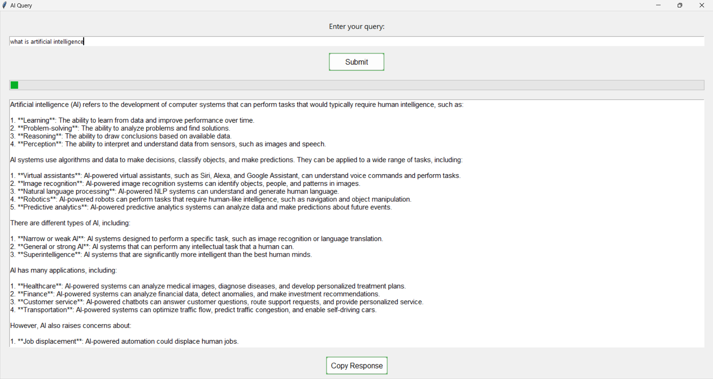

# AI Query Application using Groq API

This Python application provides a simple graphical user interface (GUI) for interacting with the Groq API to send queries and receive responses using a pre-defined AI model (LLAMA-3.1-70B). The application is built with the `Tkinter` library for creating the user interface and threading to ensure smooth interaction without freezing the GUI.

## Screenshots


## 💻 Tech Stack:


## Features

- **Query Input**: Allows the user to input a query that will be sent to the Groq API.
- **Response Display**: Displays the AI's response in a text box.
- **Progress Indicator**: Shows a progress bar while the query is being processed.
- **Keyboard Shortcuts**: Supports the use of the "Enter" key for submitting queries and "Shift + Enter" to add new lines to the query.
- **Copy to Clipboard**: Allows copying the AI's response to the clipboard with a click of a button.
- **Asynchronous Requests**: Uses threading to make API requests without blocking the UI.

## Prerequisites

- Python 3.x
- The following Python libraries are required:
  - `tkinter`
  - `groq` (Install using `pip install groq`)
  - `logging`

## Installation

1. Clone this repository to your local machine:

```bash
git clone https://github.com/your-repo/ai-query-app.git
cd ai-query-app
```

2. Install the required Python libraries:

```bash
pip install groq
```

3. Set your Groq API Key in the environment variable:

```bash
export GROQ_API_KEY="your-groq-api-key"
```

4. Run the application:

```bash
python app.py
```

## Usage

1. **Enter your query**: Type your question in the input field.
2. **Submit the query**: Press the `Submit` button or hit `Enter` to send the query to the Groq API. If you want to add a new line while typing, press `Shift + Enter`.
3. **Wait for response**: A progress bar will appear indicating the response is being fetched.
4. **View the response**: The AI's response will be displayed in the text box.
5. **Copy the response**: Click the `Copy Response` button to copy the AI's response to the clipboard.

## Shortcut Integration

One interesting use case is to make this Python file an executable and create a desktop shortcut with an assigned keyboard shortcut, allowing you to quickly open the application and interact with the AI:

1. On Windows:
   - Convert the Python file into an executable using a tool like `pyinstaller`.
   - Create a shortcut for the `.exe` file.
   - In the shortcut properties, assign a keyboard shortcut for opening the app.

2. On Mac or Linux:
   - Create a shell script that runs the Python file.
   - Assign a global keyboard shortcut through the system settings.

## Known Limitations

- **Chat History**: Currently, the application doesn't maintain chat history or context across queries. Adding support for this feature would greatly enhance the user experience, as it would allow for more coherent conversations with the AI over time.

## Future Improvements

- **Add Chat History**: Implement functionality to maintain a history of user queries and AI responses to provide better context in multi-turn conversations.
- **Error Handling**: Improve error handling for network issues or invalid API key errors.
- **Model Configuration**: Allow users to choose different models or tweak model parameters directly from the UI.

---

Feel free to contribute or suggest improvements to this application by submitting a pull request or opening an issue!

